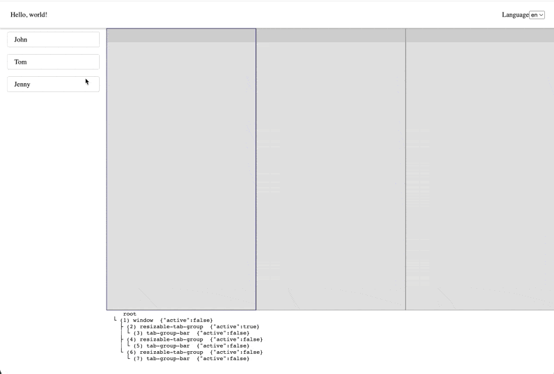

<h1 align="center">
  MeogicTabManager
</h1>

[中文文档](./README_cn.md)
[Online Demo](https://meogic-tab-manager-playground-8bol5bt9u-meogic.vercel.app/)


Meogic-tab-manager is an extensible, headless JavaScript framework.
Meogic-tab-manager aims to provide a rebuild web page structure freely, customize web page component freely, and even override the event listener inside the framework developer experience.
Meogic-tab-manager support using Vue, React, etc... UI framework to build dynamic tab pane, which can also response to global variables.


# Getting started
```shell
npm install @meogic/tab-manager-vue --save
```

## How to customize tab pane
Refer to [UserTabNode](./packages/playground-vue/src/nodes/UserTabNode.ts)

## How to customize tab group
Refer to [ResizableTabGroupNode](./packages/tab-manager-resizable/src/ResizableTabGroupNode.ts)

## How to register after customize
In initial config, add specific Node class, refer to [App.vue](./packages/playground-vue/src/App.vue#L17)

## Developing attention
1. Don't use `tabManager.dispatchCommand` to trigger specific response where response to specific event.Because it will trigger a lot update not need, which turns out `tabManager.registerUpdateListener` get wrong variable


## Data structure
Default situation
```yaml
root-node:
  - container-node
    - background-node
    - grid-node
    - svg-node
      - view-port-node
        - stage-node
        - edge-node
        - shape-node
``` 

Add new tab
```yaml
root-node:
  - window-node
    - tab-group-node
      - tab-node
      - tab-node
```

Split the tab
```yaml
root-node:
  - window-node
    - tab-group-node
      - tab-node
      - tab-node
    - tab-group-node
      - tab-node
```

Continuing split the tab
```yaml
root-node:
  - window-node
    - window-node
      - tab-group-node
        - tab-node
        - tab-node
      - tab-group-node
        - tab-node
    - tab-group-node
      - tab-node
```

## For developing
```shell
npm i --force
npm run dev
```
### how to add a new module
1. create a sub dir in packages
2. add that dir in [packages.js](./scripts/npm/packages.js#L14)
3. add that dir in [jest.config.js](./jest.config.js#L27),so you can write unit test.
4. add that dir in [playwright.config.js](./playwright.config.js#L19), so you can run e2e test.
5. add that dir in [build.js](./scripts/build.js#L209) order by alphabetical
### how to run test
```shell
npm run test-unit
npm run test-e2e-chromium
```
### how to publish
```shell
npm run release
```

### License

MeogicTabManager is [MIT licensed](https://github.com/meogic-tech/meogic-tab-manager/blob/main/LICENSE).
