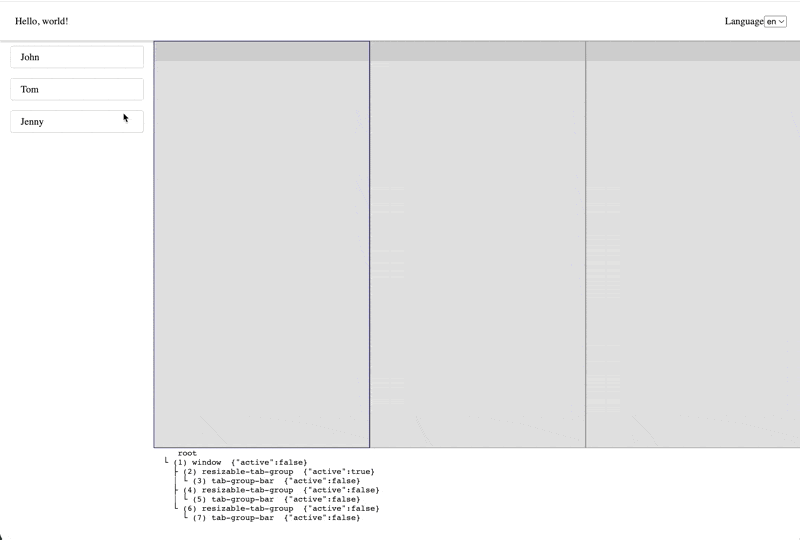

<h1 align="center">
  MeogicTabManager
</h1>

[English document](./README.md)

[在线示例](https://meogic-tab-manager-playground-8bol5bt9u-meogic.vercel.app/)

MeogicTabManager是一个有可拓展性的、headless的JavaScript标签页管理框架。
MeogicTabManager旨在提供可自由组装页面框架、自定义页面组件、甚至覆盖框架自带事件响应的开发体验。
MeogicTabManager支持通过Vue、React、以及其它UI框架来注册显示各式各样的动态的标签页，同时还能响应全局变量的变化。


# 快速开始
```shell
npm install @meogic/tab-manager-vue --save
```

## 如何自定义标签页
参照[UserTabNode](./packages/playground-vue/src/nodes/UserTabNode.ts)

## 如果自定义标签组
参照[ResizableTabGroupNode](./packages/tab-manager-resizable/src/ResizableTabGroupNode.ts)

## 自定义后如何注册
在初始化config中，添加对应的Node类，参照[App.vue](./packages/playground-vue/src/App.vue#L17)

## 开发注意
1. 不要在事件响应的地方再调用`tabManager.dispatchCommand`来触发对应的响应，而是直接调用对应的方法。因为那样会导致很多不必要的update，最终导致`tabManager.registerUpdateListener`拿到的值不正确

## 数据结构
默认情况
```yaml
root-node:
  - window-node
    - tab-group-node
      - tab-node
```

新开一个tab
```yaml
root-node:
  - window-node
    - tab-group-node
      - tab-node
      - tab-node
```

切分窗口
```yaml
root-node:
  - window-node
    - tab-group-node
      - tab-node
      - tab-node
```

切分窗口
```yaml
root-node:
  - window-node
    - tab-group-node
      - tab-node
      - tab-node
    - tab-group-node
      - tab-node
```

继续切分窗口
```yaml
root-node:
  - window-node
    - window-node
      - tab-group-node
        - tab-node
        - tab-node
      - tab-group-node
        - tab-node
    - tab-group-node
      - tab-node
```

## 给开发者
```shell
npm i --force
npm run dev
```
### 如何添加一个新的模块
1. 在packages下新增子文件夹
2. 将那个文件夹的信息添加到[packages.js](./scripts/npm/packages.js#L14)
3. 将那个文件夹的信息添加到[jest.config.js](./jest.config.js#L27)，以便你可以进行单元测试
4. 将那个文件夹的信息添加到[playwright.config.js](./playwright.config.js#L19)，以便你可以进行端到端测试
5. 将那个文件夹的信息添加到[build.js](./scripts/build.js#L209)，根据字母排序
### 如何运行测试
```shell
npm run test-unit
npm run test-e2e-chromium
```
### 如何发布
```shell
npm run release
```

### License

MeogicTabManager is [MIT licensed](https://github.com/meogic-tech/meogic-tab-manager/blob/main/LICENSE).
